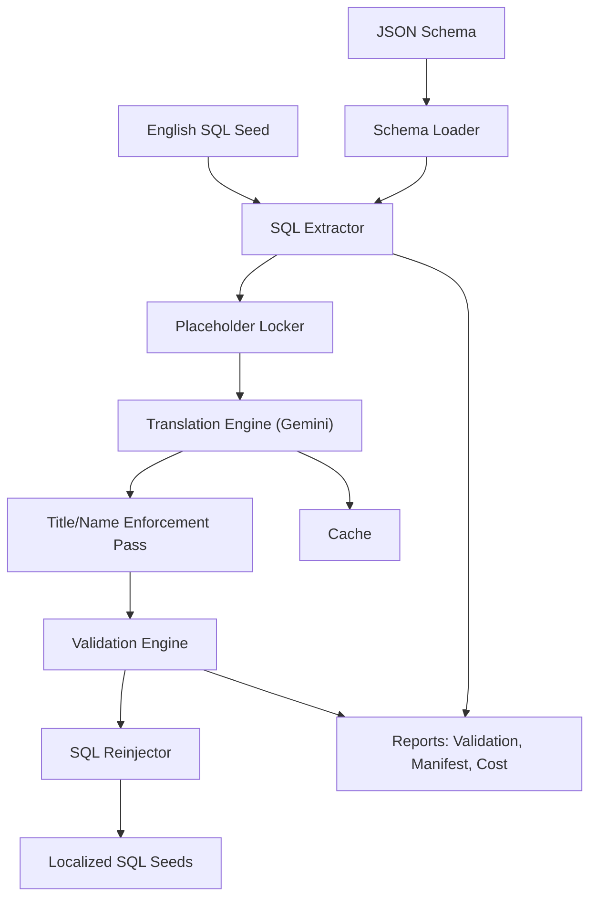
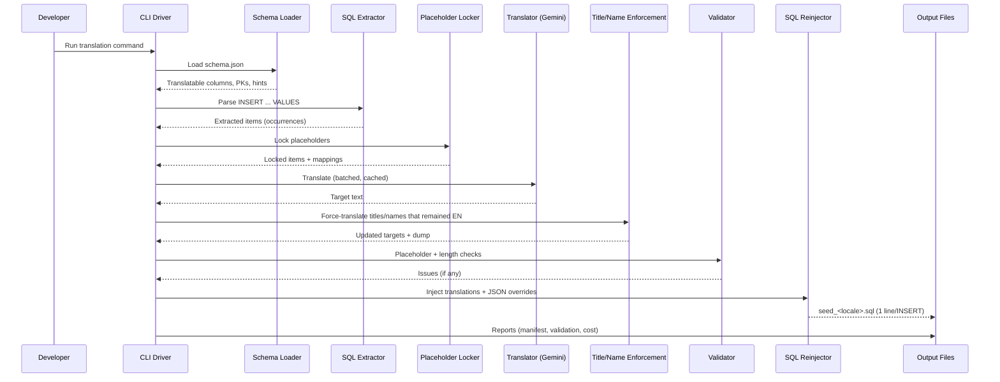

# 🌐 Multilingual Seed Database Translation Pipeline

This repository provides a **modular, production-ready pipeline** for translating English SQL seed databases into multiple languages while preserving **IDs, placeholders, and schema integrity**.
It targets real seeds (e.g., **Slack, Amazon, Jira**) and takes a **JSON schema + English SQL** as input, producing localized SQL per target locale.



---

## Overview

The pipeline performs:

1. **Schema-driven Extraction**

   * Loads schema (`.json`) and SQL seed (`.sql`).
   * Picks **translatable columns** (VARCHAR/TEXT/JSON) only.
   * Skips IDs, timestamps, flags, technical fields.

2. **Placeholder Locking**

   * Protects **IDs, URLs, placeholders (`%s`, `${VAR}`), Slack mentions `<@U123>`**, etc.
   * Ensures LLM never corrupts them.

3. **Translation (Gemini)**

   * Sends locked text in **batched** requests.
   * **SQLite cache** prevents re-translating the same string.
   * Enforces placeholder preservation and tracks costs.

4. **Title/Name Enforcement Pass**

   * Reads the bilingual dump and **re-translates** only those **`title` / `item_name` / `product_types`** entries whose **target equals the English source**.
   * Uses a stricter, role-specific prompt to **guarantee translation** (brands/model numbers remain intact).
   * Updates the bilingual dump and in-memory maps, so reinjection uses the enforced text.

5. **Validation**

   * Placeholder parity.
   * Length ratio checks.
   * Optional glossary consistency.

6. **Reinjection**

   * Rebuilds localized SQL, preserving **schema & JSON**.
   * Applies **locale-specific JSON overrides** (currency, marketplace, addresses, enums).
   * Emits **one physical line per INSERT**, **no blank lines** between inserts, and preserves **semicolons inside strings**.

7. **Outputs & Reports**

   * Localized SQL (one file per locale).
   * Translation manifest & bilingual dumps.
   * Validation reports and cost estimates.

---

## Detailed Sequence



---

## Features

* **Schema-aware extraction** of only human-readable fields.
* **Robust SQL parsing** (handles quotes, comments, `$tag$` blocks, embedded `;`).
* **Placeholder safety** via lock/unlock around translation.
* **Batching + caching** to minimize cost and variance.
* **Enforcement pass** guarantees non-English **titles / item names / product\_types**.
* **Locale overrides** for **currency**, **marketplace IDs**, **addresses**, and **enums**.
* **Validation** for placeholder parity & length ratios.
* **Deterministic address randomization** (per-row seed) while respecting key style (camel vs snake).
* **Clean SQL output**: **each INSERT on one line**, **no empty lines** between statements, **final newline** preserved.

---

## Inputs & Outputs

### Inputs

* **Schema JSON** (`db_XXXX.json`): table/columns, types, PKs.
* **Seed SQL** (`db_XXXX.sql`): English seed data.

### Outputs

* **Localized SQL**: `seed_fr_FR.sql`, `seed_de_DE.sql`, …
* **Bilingual dumps**: `translations_fr_FR.json` (side-by-side, occurrence-keyed).
* **Validation reports**: `validation_fr_FR.json`.
* **Translation manifest**: `translation_manifest.json`.
* **Run report**: `run_report.json` (est. chars & cost).
* **Cache**: `.llm_cache.sqlite`.

---

## Supported Locales

| Code   | Language              |
| ------ | --------------------- |
| pt\_BR | Portuguese (Brazil)   |
| fr\_FR | French (France)       |
| it\_IT | Italian (Italy)       |
| de\_DE | German (Germany)      |
| es\_MX | Spanish (Mexico)      |
| zh\_CN | Chinese (Simplified)  |
| zh\_HK | Chinese (Hong Kong)   |
| zh\_TW | Chinese (Traditional) |
| ja\_JP | Japanese              |
| ko\_KR | Korean                |
| vi\_VN | Vietnamese            |
| tr\_TR | Turkish               |
| nl\_NL | Dutch                 |
| sv\_SE | Swedish               |
| nb\_NO | Norwegian (Bokmål)    |
| da\_DK | Danish                |

---

## Modules

* **`schema_loader.py`**
  Loads schema & **DomainProfile**, computes:

  * Translatable columns per table.
  * Primary keys.
  * Column order.
  * Schema hints (e.g., `json_string_keys`).
* **`sql_extractor.py`**
  Parses `INSERT ... VALUES` safely and extracts only columns marked translatable.
  JSON extraction respects `SchemaHints.json_string_keys`.
* **`placeholder_lock.py`**
  Locks/unlocks placeholders (IDs, SKUs, URLs, mentions, etc.) before/after translation.
* **`translator_gemini.py`**
  Batched calls to Gemini with retries, cost tracking, and cache integration.
* **`cache.py`**
  SQLite cache for (locked-source, locale) → translation.
* **`validators.py`**
  Placeholder parity, length ratio, optional glossary checks.
* **`reinjector.py`**
  Rebuilds SQL with:

  * **One-line INSERTs**, no blank lines in between.
  * **BOM-safe** parsing for the first statement.
  * JSON overrides (currency, marketplace, addresses, enums).
  * Scalar overrides (e.g., `marketplace_id`, `buyer_county`).
  * Lenient JSON loading for Python-style `True/False/None`.
* **`profiles/amazon.py`**
  Domain profile with **system rules**, **force-include columns**, **JSON overrides by locale**, and **address pools**.
* **`cli.py`**
  End-to-end orchestration (extraction → translation → enforcement → validation → reinjection → reports).

---

## Domain Profiles (example: Amazon)

**`profiles/amazon.py`** provides:

* **System rules** guiding the LLM (what to translate vs. preserve).
* **Force-include columns** to always extract/translate:

  * `listings_items`: `product_type`, `title`, `description`
  * `catalog_items`: `product_types`, `attributes`, `sales_ranks`, `item_name`
* **`json_overrides_by_locale`**:

  * **Currency**: sets `currency_code` **and** aliased forms (`currencyCode`, `CurrencyCode`), plus nested pricing:

    * `$.listingPrice.currencyCode`
    * `$.shipping.currencyCode`
  * **Marketplace**: replaces `marketplace_ids` arrays (e.g., US → BR/FR/MX).
  * **Addresses**: random but deterministic, schema-preserving, for `shipping_address` / `billing_address`.
  * **Enums**: `map_values` tables for `order_status`, `shipment_status`, `verification_status`, `payment_method`, etc.
* **Built-in address pools** for `fr_FR`, `pt_BR`, `es_MX`.

> 🔎 The reinjector is **alias-aware** for `currency_code` / `currencyCode` / `CurrencyCode` and for `marketplace_ids` / `marketplaceIds`.

---

## Title/Name Enforcement Pass

After the first translation pass, the CLI loads `translations_<locale>.json` and **re-translates only entries** where:

* The column is one of **`title`**, **`item_name`**, or **`product_types`**; and
* `target == source_en` (i.e., still English).

A **stricter prompt** is used to guarantee translation while preserving brands/IDs:

```
# STRICT TITLE POLICY
All inputs in this batch are product titles or catalog item_name values.
Translate them into <locale>.
Do NOT leave them in English (unless a token is a brand name, model number, SKU, ASIN, or marketplace ID).
Preserve any placeholder tokens exactly.
Return only the translation, no quotes, one line per input.
- MUST TRANSLATE title and item name. For example, translating `Nike Running Shoes 300` to French should be `Chaussures de course Nike 300`.
```

**Selective enforcement:** This pass only touches items matching the condition above.
To limit scope even further, you can pre-edit `translations_<locale>.json` (remove rows you don’t want enforced), and re-run the CLI.

---

## JSON Handling & Overrides

* Extraction translates strings in JSON only for keys listed in **`SchemaHints.json_string_keys`**.
* **Arrays of strings** (e.g., `["SHOES"]`) are **not** translated by default unless surfaced via a key in `json_string_keys`.
  You can still localize them with **array replacement** overrides:

  ```json
  {
    "table": "catalog_items",
    "column": "product_types",
    "json_path": "$..product_types",
    "replace_array_value": ["SHOES"],
    "new_array_value": ["CHAUSSURES"]
  }
  ```
* Currency and marketplace changes are applied anywhere in JSON using **alias-aware** setters and **path-based** rules:

  * `$..currency_code`, `$..currencyCode`, `$..CurrencyCode`
  * `$..listingPrice.currencyCode`, `$..shipping.currencyCode`
  * `$..marketplace_ids` array replacement
* Addresses are replaced **schema-preserving** (key style maintained) using seeded randomness per row.

---

## SQL Output Format

* **Each INSERT** is emitted as **one physical line**:

  ```sql
  INSERT INTO listings_items ("id","seller_id","seller_name",...) VALUES (...);
  ```
* **No empty lines** between INSERTs.
* **Semicolons inside strings are preserved** (statement splitting is quote-aware).
* File ends with **a single trailing newline**.
* **BOMs** (`\ufeff`) are stripped so the very first INSERT is processed correctly.

---

## Logging

Structured logs by phase:

* **INFO**: phase progress (counts, costs).
* **DEBUG**: item details (optional).
* **WARNING**: retries, validations.
* **ERROR**: parsing/API failures.

Example:

```
[INFO] Extracted items: 16408
[INFO] Unique source strings: 1533
[INFO] Exported bilingual dump: ./out/translations_fr_FR.json
[INFO] Title enforcement: fixed 7 occurrence(s); dump updated.
[INFO] Validation issues for fr_FR: 0 (see ./out/validation_fr_FR.json)
[INFO] Wrote ./out/seed_fr_FR.sql
```

---

## Run Examples

### Full run (single locale)

```bash
python -m i18n_seed.cli translate \
  --schema ./inputs/schema.json \
  --input-sql ./inputs/seed.sql \
  --output ./out \
  --locales fr_FR \
  --llm-provider gemini \
  --llm-model gemini-2.0-flash-001 \
  --cache .llm_cache.sqlite \
  --qps 0.4 \
  --batch-chars 3500
```

### All 16 locales

```bash
python -m i18n_seed.cli translate \
  --schema ./inputs/schema.json \
  --input-sql ./inputs/seed.sql \
  --output ./out \
  --locales pt_BR fr_FR it_IT de_DE es_MX zh_CN zh_HK zh_TW ja_JP ko_KR vi_VN tr_TR nl_NL sv_SE nb_NO da_DK \
  --llm-provider gemini \
  --llm-model gemini-2.0-flash-001
```

> Use `--dry-run` to test extraction/formatting without calling Gemini.

---

## Setup (macOS, Linux, Windows)

### Prerequisites

* **Python 3.10+**
* **Gemini API key** in environment:

  ```bash
  export GEMINI_API_KEY="your_api_key_here"   # macOS/Linux
  ```

  ```powershell
  setx GEMINI_API_KEY "your_api_key_here"     # Windows PowerShell
  ```

### Install

```bash
pip install -r requirements.txt
```

### Virtualenv (recommended)

```bash
python3 -m venv .venv
source .venv/bin/activate         # macOS/Linux
# .\.venv\Scripts\Activate.ps1    # Windows
pip install -r requirements.txt
```

---

## Tips & Notes

* Keep the **SQLite cache** between runs to save time/money.
* If you see an English title slip through, check `translations_<locale>.json`:
  enforcement only re-translates when **`target == source_en`** for **title/item\_name/product\_types**.
* If the **first INSERT** appears untranslated, ensure your input file doesn’t contain **BOMs**—the pipeline strips them, but verify source control settings.
* For **`catalog_items.product_types`** arrays of strings, either:

  * add a profile **array replacement** rule (see JSON example above), or
  * extend `SchemaHints` to mark a key wrapping those strings (so they’re extracted as strings), then re-run.

---

## Project Structure

```
i18n_seed/
  cli.py
  schema_loader.py
  sql_extractor.py
  placeholder_lock.py
  translator_gemini.py
  translator_base.py
  validators.py
  reinjector.py
  cache.py
  cost_tracker.py
  utils.py
  profiles/
    __init__.py
    amazon.py        # domain profile: rules, overrides, address pools
  assets/
    addresses/
      fr_FR.json     # optional external pools (fallback to built-ins)
      ...
  outputs/
    ...              # generated files (sql, reports, dumps)
```

---

## License

MIT (see `LICENSE`).

---
