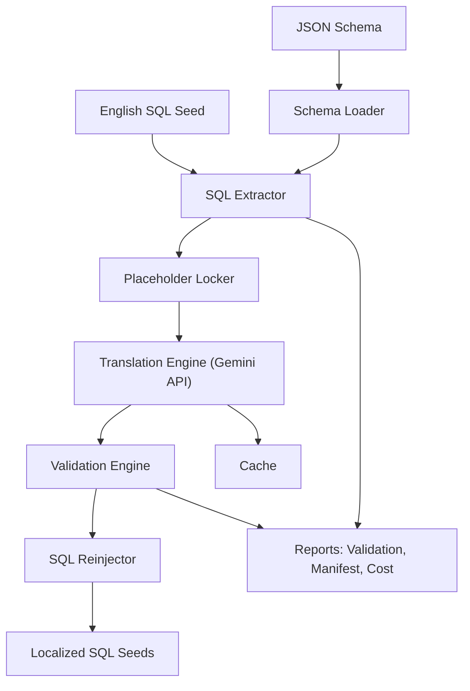
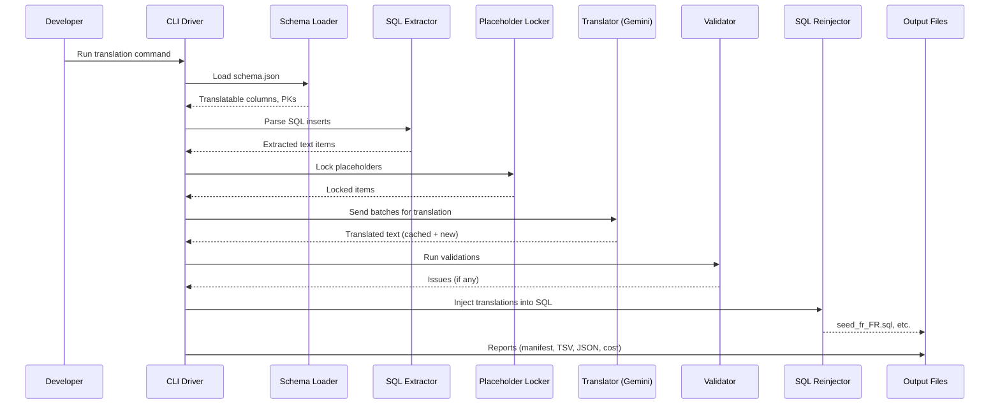

# 🌐 Multilingual Seed Database Translation Pipeline

This repository provides a **modular, production-ready pipeline** for translating English SQL seed databases into multiple languages, while preserving **IDs, placeholders, and schema integrity**.

The pipeline was designed for real applications like **Slack, Amazon, and Jira seeds**, using a JSON schema + English SQL seed as input, and producing localized SQL seeds for 16 target locales.


----------

## Overview

The pipeline performs:

1.  **Schema-driven Extraction**
    
    -   Reads schema (`.json`) and SQL seed (`.sql`).
        
    -   Selects **translatable columns** only (VARCHAR/TEXT/JSON).
        
    -   Skips IDs, timestamps, flags, technical fields.
        
2.  **Placeholder Locking**
    
    -   Protects **IDs, URLs, placeholders (`%s`, `${VAR}`), mentions `<@U123>`**, etc.
        
    -   Prevents LLMs from breaking them during translation.
        
3.  **Translation (Gemini API)**
    
    -   Sends extracted text in batches.
        
    -   Uses caching to avoid re-translation.
        
    -   Enforces placeholder preservation.
        
    -   Tracks estimated costs.
        
4.  **Validation**
    
    -   Placeholder parity.
        
    -   Length ratio checks.
        
    -   Optional glossary enforcement.
        
5.  **Reinjection**
    
    -   Rebuilds localized SQL seed.
        
    -   Preserves IDs, schema, JSON structure.
        
    -   Writes per-locale SQL files.
        
6.  **Outputs & Reports**
    
    -   Localized SQL seeds.
        
    -   Translation manifests.
        
    -   Validation reports.
                
    -   Side-by-side bilingual JSON dumps.
        

----------

## Detailed Sequence


----------

## Features

-   **Schema-aware:** Only translates columns meant for human text.
    
-   **Placeholder safe:** Locks placeholders before translation.
    
-   **Batching + Caching:** Optimized API usage.
    
-   **Multi-locale:** Generates localized seeds for 16 languages.
    
-   **Validation:** Placeholder, length, glossary checks.
    
-   **Detailed logging:** Each phase logs counts, and issues.
    
-   **Outputs bilingual dumps:** For traceability >> check manually each source sent to the llm and its translation.
    

----------

## Inputs & Outputs

### Inputs

-   **Schema JSON** (`db_XXXX.json`): Database structure, column types, PKs.
    
-   **Seed SQL** (`db_XXXX.sql`): English application seed data.
    

### Outputs

-   **Localized SQL seeds:**  
    `seed_fr_FR.sql`, `seed_de_DE.sql`, …
    
-   **Bilingual dumps:**  
    `translations_fr_FR.tsv` (occurrence key, English, French)  
    `translations_fr_FR.json` (same, JSON)
    
-   **Validation reports:**  
    `validation_fr_FR.json` (issues per string).
    
-   **Translation manifest:**  
    `translation_manifest.json` (traceability of all occurrences).
    
-   **Run report:**  
    `run_report.json` (cost estimates, stats).
    
-   **Cache:**  
    `.llm_cache.sqlite` (reuses translations).
    

----------

## Supported Locales

| Code    | Language                  | Status      |
|---------|---------------------------|-------------|
| pt_BR   | Portuguese (Brazil)       | Native      |
| fr_FR   | French (France)          | Native      |
| it_IT   | Italian (Italy)          | Native      |
| de_DE   | German (Germany)         | Native      |
| es_MX   | Spanish (Mexico)         | Native      |
| zh_CN   | Chinese (Simplified)     | Native      |
| zh_HK   | Chinese (Hong Kong)      | Custom      |
| zh_TW   | Chinese (Traditional)    | Native      |
| ja_JP   | Japanese                 | Native      |
| ko_KR   | Korean                   | Native      |
| vi_VN   | Vietnamese               | Custom      |
| tr_TR   | Turkish                  | Native      |
| nl_NL   | Dutch                    | Native      |
| sv_SE   | Swedish                  | Native      |
| nb_NO   | Norwegian (Bokmal)       | Fallback    |
| da_DK   | Danish                   | Native      |

-------

## Modules

-   **`schema_loader.py`** → loads schema, selects text columns.
    
-   **`sql_extractor.py`** → parses SQL, extracts only translatable text.
    
-   **`placeholder_lock.py`** → locks placeholders, restores them after.
    
-   **`translator_gemini.py`** → calls Gemini API in batches, with retries.
    
-   **`cache.py`** → SQLite cache of translations.
    
-   **`validators.py`** → runs placeholder parity, length, glossary checks.
    
-   **`reinjector.py`** → reconstructs SQL with translations.
    
-   **`cli.py`** → orchestrates the whole pipeline.
    

----------

## Logging

Every run produces structured logs:

-   **INFO:** Phase progress (extraction counts, cost estimate).
    
-   **DEBUG:** Detailed item-level logs (optional).
    
-   **WARNING:** API retries, validation issues.
    
-   **ERROR:** Failures in schema/SQL parsing.
    

Example log:

```
[INFO] Extracted items: 16408
[INFO] Unique source strings: 1533
[WARNING] Gemini request failed (retrying in 2.6s)
[INFO] Validation issues for fr_FR: 0 (see ./out/validation_fr_FR.json)
[INFO] Exported bilingual dump: ./out/translations_fr_FR.tsv

```

----------

## Validation

Checks include:

-   **Placeholder parity:** All locked placeholders present in output.
    
-   **Length ratio:** Detects truncations/expansions.
    
-   **Glossary consistency:** Ensures consistent terminology across runs.
    

----------

## Run Example


### Full run 

```bash
python -m i18n_seed.cli translate \
  --schema schema.json \
  --input-sql seed.sql \
  --output ./out \
  --locales fr_FR \
  --llm-provider gemini \
  --llm-model gemini-2.0-flash-001 \
  --cache .llm_cache.sqlite \
  --qps 0.4 --batch-chars 3500
```

### All 16 locales

```bash
python -m i18n_seed.cli translate \
  --schema schema.json \
  --input-sql seed.sql \
  --output ./out \
  --locales pt_BR fr_FR it_IT de_DE es_MX zh_CN zh_HK zh_TW ja_JP ko_KR vi_VN tr_TR nl_NL sv_SE nb_NO da_DK \
  --llm-provider gemini --llm-model gemini-2.0-flash-001

```

----------

## ⚙️ How to Use (macOS & Windows)

### 1. Prerequisites

-   **Python 3.10+** installed.
    
-   A valid **Gemini API key** set as an environment variable:
    
    ```bash
    export GEMINI_API_KEY="your_api_key_here"   # macOS / Linux
    setx GEMINI_API_KEY "your_api_key_here"     # Windows PowerShell
    
    ```
    
-   Install dependencies (inside a virtual environment is recommended):
    
    ```bash
    pip install -r requirements.txt
    
    ```
    

----------

### 2. macOS / Linux

#### a) Clone and setup environment

```bash
git clone https://your-repo-url.git
cd i18n_seed_pipeline

# Create & activate a virtual environment
python3 -m venv .venv
source .venv/bin/activate

# Install dependencies
pip install -r requirements.txt

```

#### b) Run translation (example for French)

```bash
python -m i18n_seed.cli translate \
  --schema ./inputs/schema.json \
  --input-sql ./inputs/seed.sql \
  --output ./out \
  --locales fr_FR \
  --llm-provider gemini \
  --llm-model gemini-2.0-flash-001 \
  --cache .llm_cache.sqlite \
  --qps 0.4 --batch-chars 3500

```

#### c) Outputs

-   Localized SQL: `./out/seed_fr_FR.sql`
    
-   Validation report: `./out/validation_fr_FR.json`
    
-   Bilingual dump: `./out/translations_fr_FR.tsv`
    

----------

### 3. Windows (PowerShell)

#### a) Clone and setup environment

```powershell
git clone https://your-repo-url.git
cd i18n_seed_pipeline

# Create & activate virtual environment
py -3 -m venv .venv
.\.venv\Scripts\Activate.ps1

# Install dependencies
pip install -r requirements.txt

```

#### b) Run translation (example for German)

```powershell
python -m i18n_seed.cli translate `
  --schema .\inputs\schema.json `
  --input-sql .\inputs\seed.sql `
  --output .\out `
  --locales de_DE `
  --llm-provider gemini `
  --llm-model gemini-2.0-flash-001 `
  --cache .llm_cache.sqlite `
  --qps 0.4 --batch-chars 3500

```

_(Note the backticks `` ` `` for line continuation in PowerShell.)_

#### c) Outputs

-   Localized SQL: `.\\out\\seed_de_DE.sql`
    
-   Validation report: `.\\out\\validation_de_DE.json`
    
-   Bilingual dump: `.\\out\\translations_de_DE.tsv`
    

----------

### 4. Tips & Notes

-   Use **`--dry-run`** first to test parsing & extraction without calling Gemini.
    
-   Adjust `--qps` (queries per second) and `--batch-chars` if you see API rate-limit errors.
    
-   Use `.llm_cache.sqlite` across runs to avoid paying twice for the same text.
    
-   To translate **all 16 locales at once**, list them after `--locales`.